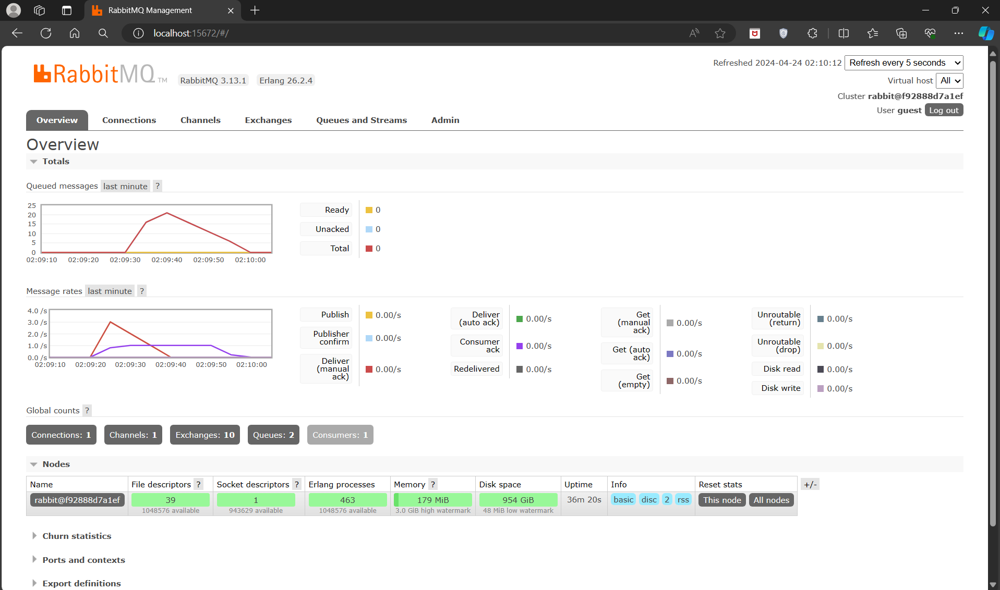
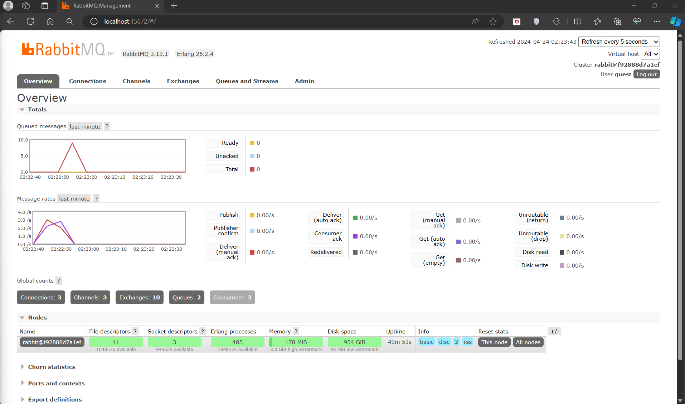

# Module 8 - Subscriber

## Question & Answer

### a. What is amqp?

AMQP (Advanced Message Queuing Protocol) is an open standard application layer protocol for message-oriented middleware. The defining features of AMQP are message orientation, queuing, routing (including point-to-point and publish-and-subscribe), reliability and security.

### b. What it means? guest:guest@localhost:5672 , what is the first quest, and what is the second guest, and what is localhost:5672 is for?

- guest:guest is the username and password for the RabbitMQ server. 
    
- localhost:5672 is the hostname and port number of the RabbitMQ server.

## Simulation slow subscriber

### Explanation :
In your subscriber directory, edit your Readme.md, add the screen capture of yours, and answer why the total number of queue is as such (in my machine is 20, what about yours?) 

- Mine is 15 or 16, then it increase to 20. The number of queues is determined by the total amount of the publisher data that has not been processed by the subscriber program. In this case it is 15 and then increase to 20, because the publisher sends 5 data each run to the message broker, And I keep spamming `cargo run` on the publisher directory. So, the number of queues will increase by 5 each time I run the publisher program and then it will decrease by 1 each time the subscriber program processes the data.

## Reflection and Running at least three subscribers

- The queued messages decrease rapidly because there are three subscriber programs that process the data from the message broker. The three subscriber programs process the data concurrently, so the queued messages decrease faster than when there is only one subscriber program.

- I see that the subscriber program is not efficient because it uses a sleep function to simulate a slow subscriber. The sleep function is used to simulate a slow subscriber, but it is not efficient because it blocks the thread and makes the subscriber program wait for a certain amount of time before processing the data. To improve the subscriber program, we can remove the sleep function and use a more efficient way to simulate a slow subscriber, such as using a delay function or a timer.